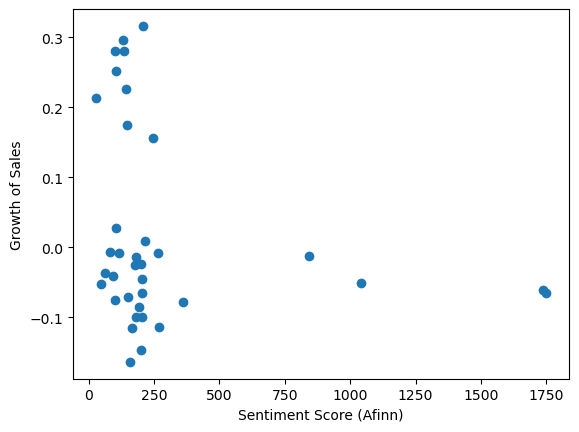
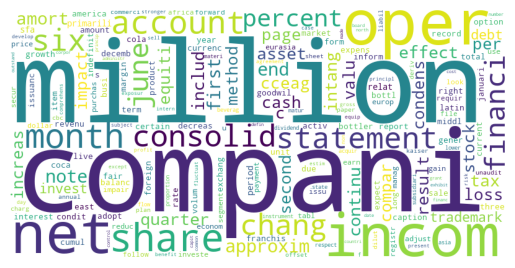

# Predict Coca-Cola's Sales Growth Using its Financial Statements
### HKU FINA4350, Spring 2023 [Course Blog](https://buehlmaier.github.io/FINA4350-student-blog-2023-01/predict-a-companys-sales-growth-using-financial-statements-by-sibo.html)


## Motivation
Sales is one key financial indicator for companies and investors. Financial statements are the most authoritative and influential documents for companies. Natural language processing (NLP) and machine learning are two powerful tools to analyze textual data. Therefore, I want to estimate and predict a company’s sales growth using NLP and machine learning to analyze its financial statements.


## Company Selection: Coca-Cola
I choose *Coca-Cola Co* (KO) for 2 main reasons. First, it is a worldwide food company listed on the *Dow Jones Industrial Average*. Second, its [stock price](https://www.google.com/finance/quote/KO:NYSE?window=MAX) fluctuates, so it is easier to estimate the impact of financial statements on different growing patterns.


## Data Collection
The time span is 1994 to 2002. I download quarterly reports (10-Q & 10-K) on [SEC EDGAR](https://www.sec.gov/edgar/browse/?CIK=21344&owner=exclude) and [company's website](https://investors.coca-colacompany.com/filings-reports/annual-filings-10-k?page=4), and save them as “.txt” files. I download quarterly sales data on *Bloomberg*. There is no sales for 2001Q4, so I substitute it with the average of 2001Q3 and 2002Q1.


## NLP Preprocessing
As original financial statements are not appropriate for direct analysis, I have to conduct some NLP preprocessing. I use `NLTK` package.

First, I change all letters to lowercase, because most small letters have the same meaning as capital letters.

```python
'101 Acceptable in _Mtd'.lower()

# Expected output: '101 acceptable in _mtd'
```

Second, I split (tokenize) whole paragraphs into words.

```python
from nltk.tokenize import word_tokenize
word_tokenize('101 acceptable in _mtd')

# Expected output: ['101', 'acceptable', 'in', '_mtd']
```

Third, I remove words starting with a number or a special character using regular expression, because they often do not carry useful information in these financial statements.

```python
import re
a = ['101', 'acceptable', 'in', '_mtd']

for i in a:
    if re.findall('(^[a-z].*)', i) == []:
        a.remove(i)
print(a)

# Expected output: ['acceptable', 'in']
```

Fourth, I remove stop words (such as “the”, “and”, “in”) because they do not carry useful information.

```python
from nltk.corpus import stopwords
stopwords = stopwords.words('english')
a = ['acceptable', 'in']

for i in a:
    if i in stopwords:
        a.remove(i)
print(a)

# Expected output: ['acceptable']
```

Fifth, many words in English are derived from a root word (e.g., “normality” is derived from “norm”). For easier analysis, I convert (stem and lemmatize) all derived words into their root forms.

```python
from nltk.stem import PorterStemmer
PorterStemmer().stem('acceptable')

# Expected output: 'accept'
```

I use `Pandas` package to merge data frames, and use `groupby` and `count` to count the number of occurrences of each word, which is also called Bag-of-Words (BOW).


## Machine learning on BOW
For supervised learning, I use BOW to estimate and predict sales growth. I put 28 quarters (80%) in the training set and 8 quarters in the test set.

```python
# Train-test split
import numpy as np
from sklearn.model_selection import train_test_split
x = np.arange(10).reshape(5, 2)
y = np.arange(5)
x_train, x_test, y_train, y_test = train_test_split(x, y, test_size=0.2, random_state=24)
```

I use 3 regression models: linear regression, random forest regressor, and XGBoost regressor; then I compute square root of mean squared error (RMSE) for each model. RF classifier model predicts most accurately.

```python
from sklearn.linear_model import LinearRegression
from sklearn import metrics

# Fit linear regression model with training data
lin = LinearRegression().fit(x_train, y_train)

# Use the fitted model to predict test data
lin_pred = lin.predict(x_test)

# Mean squared error between predictions and actual test values
metrics.mean_squared_error(y_test, lin_pred)

# The code for other models is very similar, can check sklearn documentations for more details
```

I classify the continuous outcome variable (sales growth) into 2 / 3 / 4 classes. I use 4 classification models: Naïve Bayes, logistic regression, random forest classifier, and XGBoost classifier; then I compute the predictive accuracy for each model. Logistic regression model predicts most accurately.

I also use unsupervised learning to analyze BOW. I use 2 models: k-means clustering and hierarchical clustering. I cluster financial statements of all 36 quarters into 2, 3, …, 8 clusters, and evaluate the similarity of sales growth within each cluster. The results are not desirable.

```python
from sklearn.cluster import KMeans
import matplotlib.pyplot as plt

# Fit k-means model
k_clust = KMeans(n_clusters=3, random_state=23).fit_predict(x)

# Visualize the relationship
plt.scatter(x=k_clust, y=y, c=k_clust)
```


## Sentiment analysis
The rationale of sentiment analysis is simple. In *Afinn* lexicon, positive words have higher sentiment scores.

```python
from afinn import Afinn
Afinn().score('love')  # 3
Afinn().score('hate')  # -3
```

I multiply the sentiment score of each word by its count (which is BOW), then sum up all multiplications in one document to get one sentiment score for each quarter. There is no significant relationship between sales growth and sentiment score.




## tf-idf
*tf-idf* (term frequency–inverse document frequency), similar to BOW, measures how important a word is in a collection of documents. I manually calculate it using `Pandas` on BOW. Then I input it into all models. There is no increase in performance. 2 references: [Wikipedia](https://en.wikipedia.org/wiki/Tf%E2%80%93idf), [Baike](https://baike.baidu.com/item/tf-idf/8816134).


## Case study: Highest sales growth
To understand some characteristics of an individual quarterly statement, I investigate the quarter with the highest sales growth. The highest sales growth is 31.6% in 2002Q2. Since random forest regressor is the most accurate model previously, I use it to predict this sales growth, and the result is 27.8%.

The 10 most frequent words in this statement are “compani", “million”, “oper”, “incom", “net”, “month”, “share”, “account”, “six”, “consolid”. Several points are noticeable here. First, words are being stemmed and lemmatized, so they are not in normal formats. Second, financial statements have certain templates, so frequent words in this statement may also appear frequently in other statements. Third, frequent words are closely related to business operations, so they may not carry useful information in specific situations.

I create a word cloud to better visualize the relative frequency of words.

```python
from wordcloud import WordCloud
WordCloud().generate('apple, banana, apple')
```


